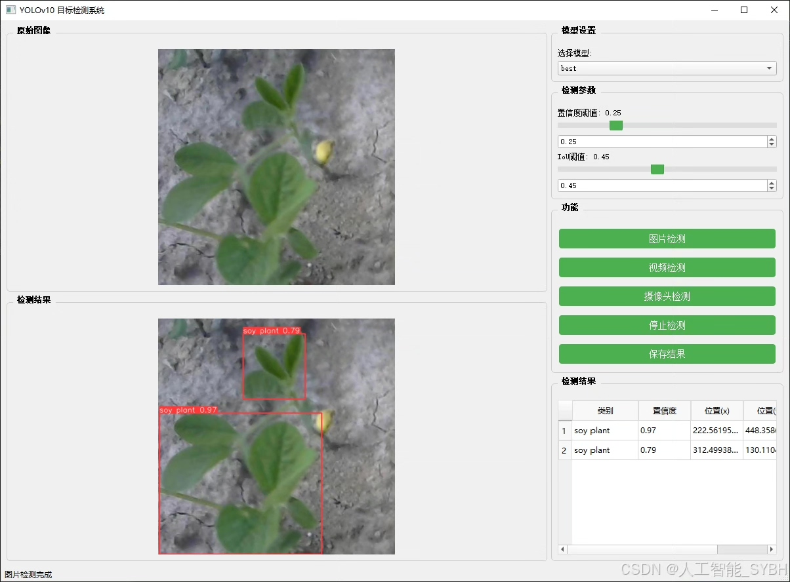
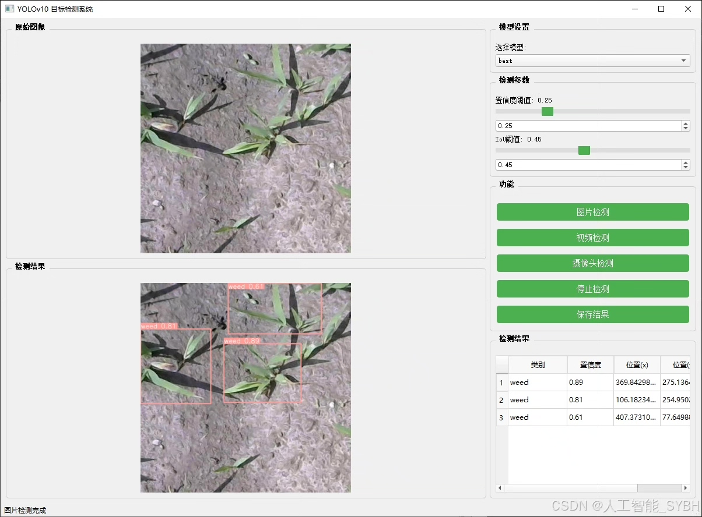
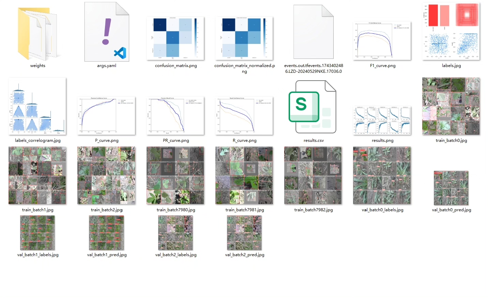
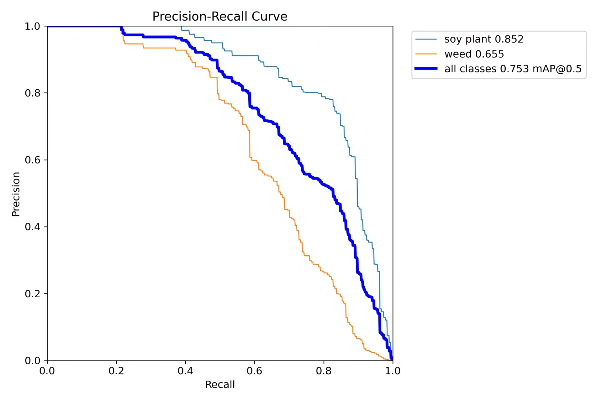
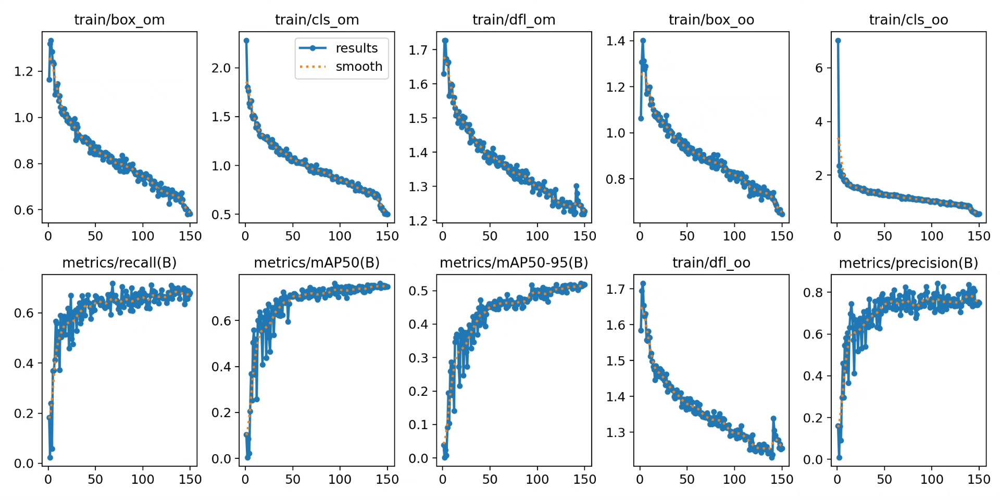
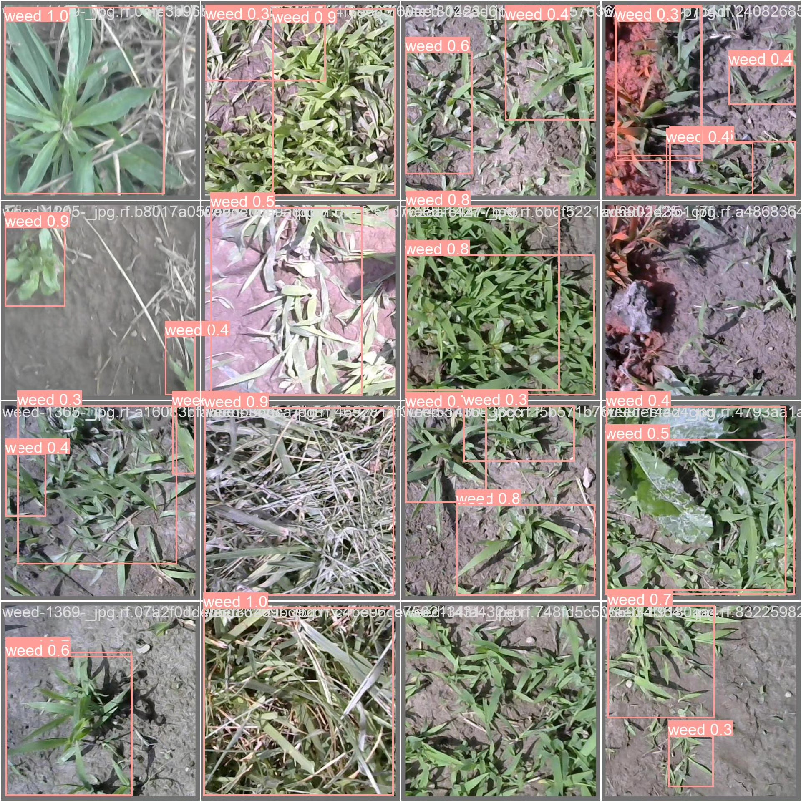
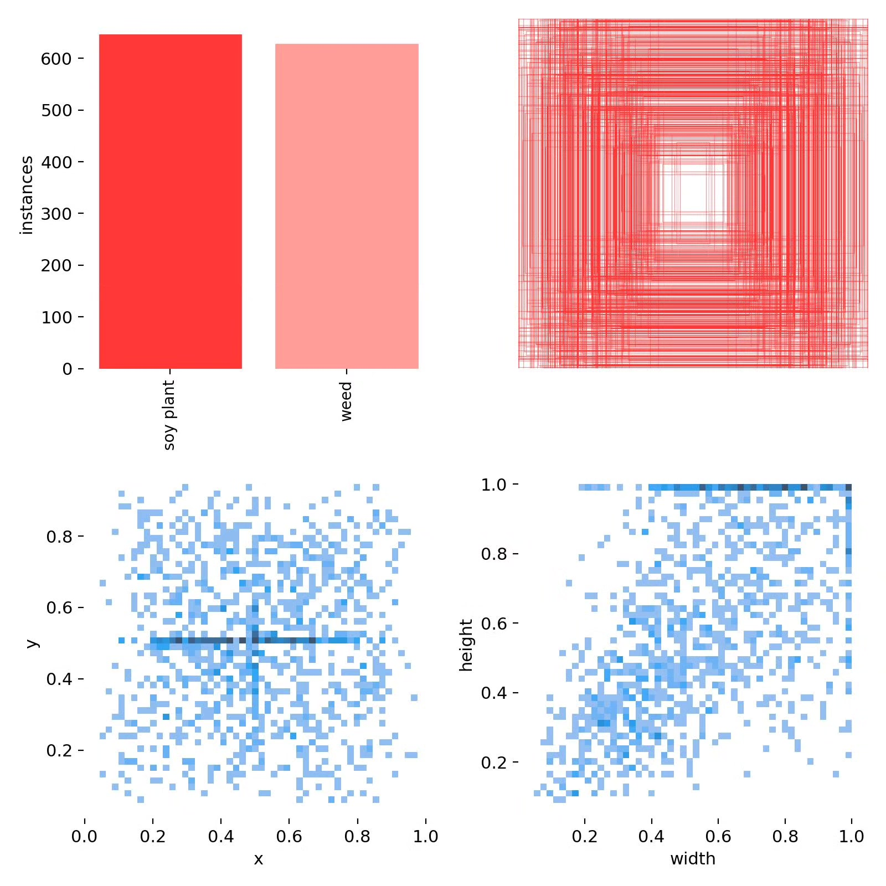
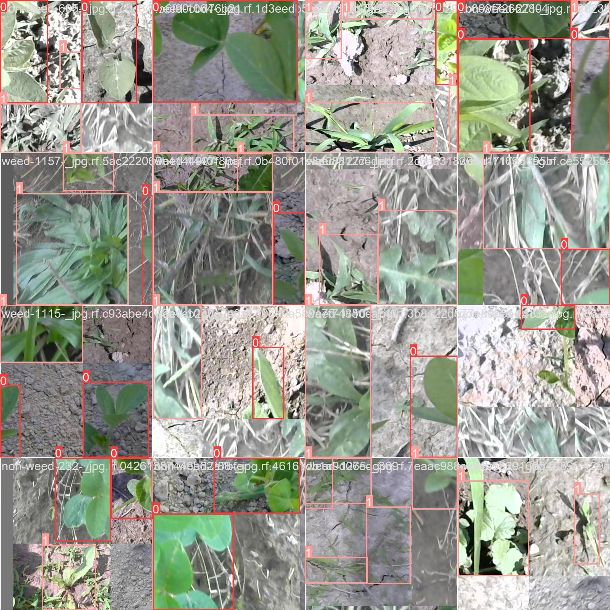

# Based on deep learning YOLOv10 for soybean weed detection system (YOLOv10)

## Body

Based on the advanced YOLOv10 object detection algorithm, this project has developed a high-precision real-time detection system for soybean weeds in the field. The system can accurately identify and differentiate between soybean plants (“soy plant”) and weeds (“weed”), with a classification count (nc) of 2. The project uses a total of 1,302 high-quality labeled images as the dataset, including 908 training sets, 260 validation sets, and 134 test sets, ensuring the scientific nature of model training and the reliability of evaluation. This system can achieve automated identification of weeds in the field, providing an intelligent solution for weed management in precision agriculture, which is of great agricultural application value and technological innovation significance.

The company's products have obtained the official commercial license certification from YOLO.

We provide after-sales service.

After payment, we will provide a WeChat account to answer questions at any time.

Environmental configuration: We will provide a tutorial on environmental configuration, and WeChat will provide answers.

Remote installation service: If you need remote configuration, an additional fee of 69 is required,

If the configuration fails, all fees will be refunded (specially for old computers only refund installation fees).

Retraining dataset: After configuring the environment, you can train on your own computer.
If you need us to retrain, just pay 69+ computing power fees (2.5 yuan/hour)

## Images

## Payment

Here is a pay link on Stripe ( https://buy.stripe.com/3cs8yP7sY87d0vu9AB ). Please contact me lonlonago@foxmail.com after funding $89, and I will send you a complete data files , thank you!

